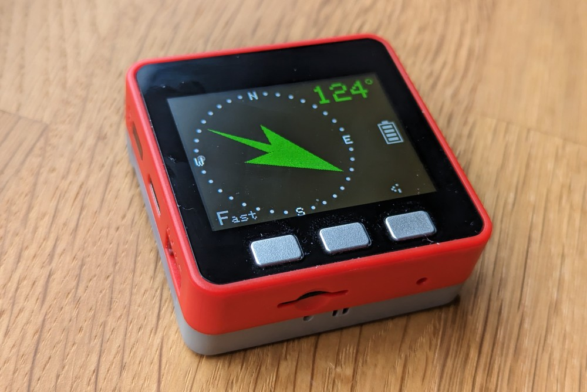

# Gyrotator firmware
- MQTT based IP control firmware, for M5Stack Fire hardware
- Control for [IP-rotator](https://github.com/ok1hra/IP-rotator) board
- Main repository [Parameterizable 3D print Antenna rotator in OpenScad](https://github.com/ok1hra/Parameterizable-3D-print-Antenna-rotator-in-OpenScad)

